# Configurable Active Filter Bank for Analog Signal Processing

## Overview

This project presents the design and simulation of a configurable active filter bank using operational amplifiers in LTspice. The objective is to study and compare the behavior of different second-order active filters commonly used in analog signal processing applications.

The project implements and analyzes the following filter responses:

- Low-Pass Filter (LPF)
- High-Pass Filter (HPF)
- Band-Pass Filter (BPF)
- Notch (Band-Stop) Filter

Each filter was designed to meet specific frequency characteristics and evaluated using multiple LTspice simulation techniques.

---

## Objectives

- Design second-order active filters using operational amplifiers.
- Analyze frequency response and cutoff frequencies.
- Compare different filter responses for analog signal processing.
- Study the effect of resistor and capacitor values on filter performance.
- Validate filter characteristics using LTspice simulations.

---

## Filter Configurations

### Low-Pass Filter
- Passes frequencies below the cutoff frequency.
- Attenuates higher-frequency components.
- Suitable for removing high-frequency noise.

### High-Pass Filter
- Passes frequencies above the cutoff frequency.
- Removes DC offset and low-frequency interference.

### Band-Pass Filter
- Allows only a selected range of frequencies to pass.
- Rejects frequencies outside the desired bandwidth.

### Notch Filter
- Rejects a narrow frequency band around the center frequency.
- Commonly used for suppressing 50 Hz or 60 Hz power-line interference.

---

## Circuit Design

Each filter is implemented using second-order active filter topology with operational amplifiers and RC networks.

The design process includes:

- Selection of cutoff frequency
- Calculation of resistor values
- Capacitor selection
- Gain verification
- Frequency response validation

---

## Simulations Performed

### AC Sweep (Bode Plot)

Used to evaluate:

- Magnitude response
- Phase response
- Cutoff frequency
- Roll-off characteristics

---

### Transient Analysis

Performed to observe:

- Time-domain response
- Output waveform
- Filter behavior with sinusoidal inputs

---

### FFT Analysis

Used to examine:

- Frequency spectrum
- Harmonic components
- Signal attenuation after filtering

---

### Parameter Sweep

Performed by varying resistor and capacitor values to observe changes in:

- Cutoff frequency
- Bandwidth
- Filter response

---

Simulation results include:

- Frequency response plots
- Time-domain waveforms
- FFT plots
- Component parameter comparison

---

## Software Used

- LTspice XVII
- Analog Devices LTspice Simulator

---

# Active Filter Bank Simulation

This repository contains the design, simulation, and validation of an active analog filter bank utilizing the Sallen-Key and Twin-T topologies. The project demonstrates the precise isolation and attenuation of specific frequency bands to process analog signals and eliminate high-frequency interference. 

All circuits were modeled and tested using LTspice. The filter performance was validated through AC sweeps (Bode plots), transient analysis in the time domain, Fast Fourier Transforms (FFT) for harmonic analysis, and parametric stepping to verify the configurability of target frequencies.

---

### Low-Pass Filter (LPF) Configuration
The core Sallen-Key topology was initially configured as a Low-Pass Filter to allow standard baseband signals to pass while heavily attenuating high-frequency noise.

* **Topological Schematic:** 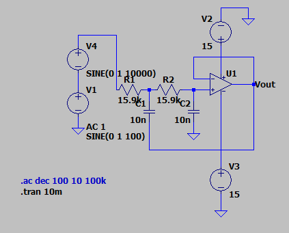
* **Transient & FFT Analysis:** 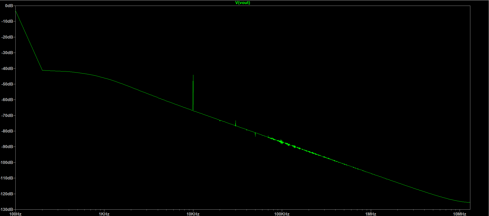
  *Result:* Successfully attenuated a 10 kHz high-frequency interference signal from a standard 100 Hz base signal.
* **Parametric Sweep:** 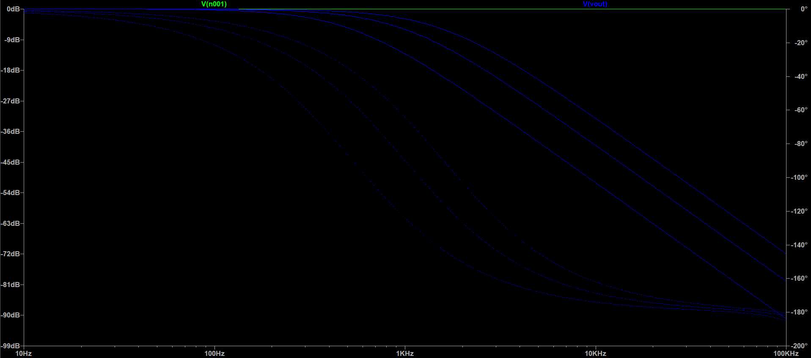
  *Result:* Demonstrated highly adjustable cutoff frequencies and roll-off characteristics by stepping feedback resistor values through 10 kΩ, 15.9 kΩ, and 30 kΩ.

---

### High-Pass Filter (HPF) Configuration
By reconfiguring the Sallen-Key topology components, the circuit was adapted to act as a High-Pass Filter, designed to block low-frequency drift and allow high-frequency signals to pass.

* **Topological Schematic:** 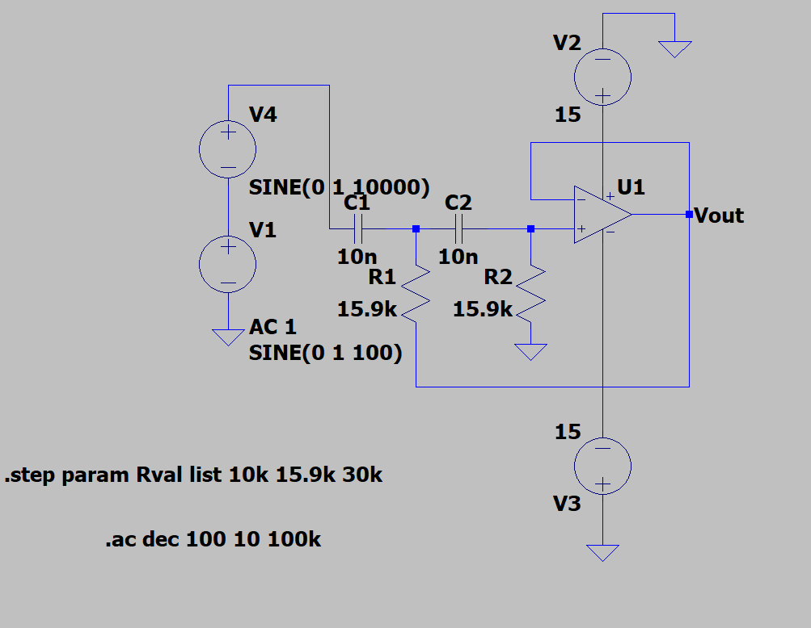
* **Transient Analysis:** 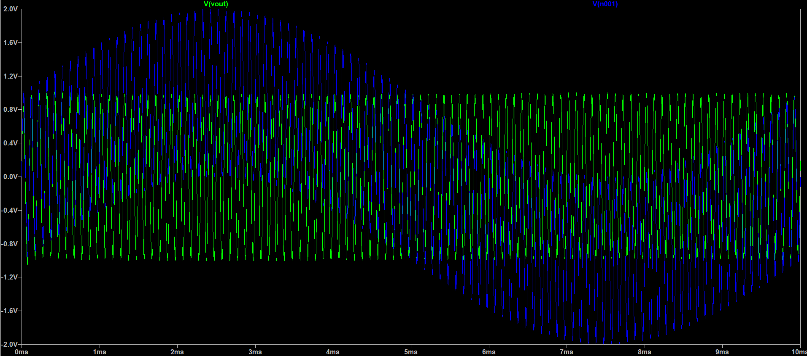
  *Result:* Successfully flattened a baseline 100 Hz wave while allowing the 10 kHz signal to pass through unattenuated, validating the low-frequency rejection.
* **Parametric Sweep:** 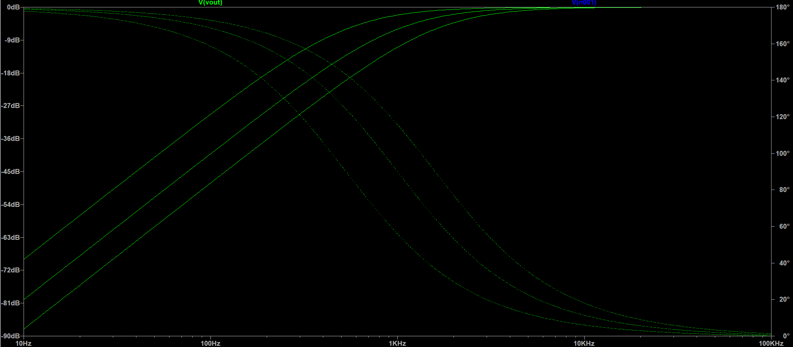
  *Result:* Visualized the shift in the -3 dB cutoff point by sweeping the primary resistor values through 10 kΩ, 15.9 kΩ, and 30 kΩ.

---

### Band-Pass Filter (BPF) Configuration
The Sallen-Key architecture was modified into a Band-Pass topology to isolate specific frequency bands, effectively attenuating both low-frequency drift and high-frequency noise simultaneously. 

* **Topological Schematic:** 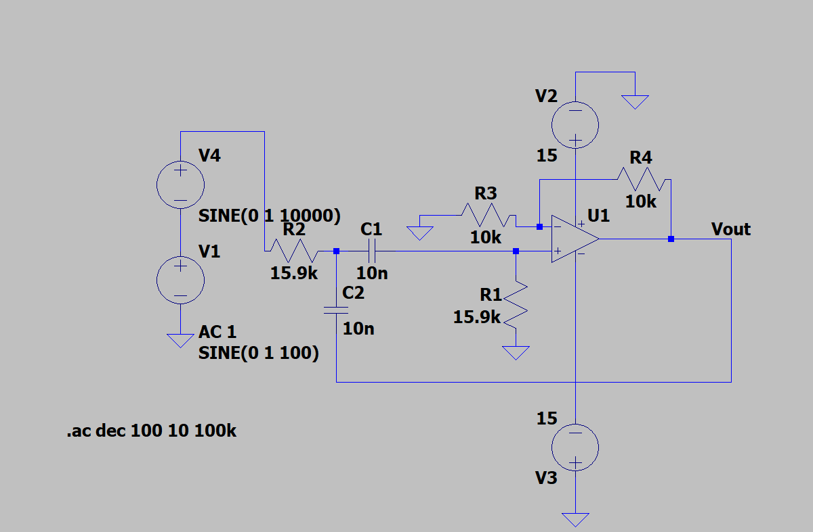
* **AC Response (Bode Plot):** 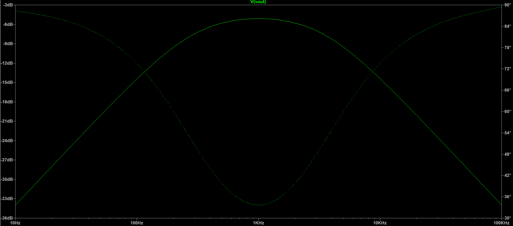
  *Result:* Achieved a distinct band-pass response with a tuned center frequency of 1 kHz, successfully rolling off frequencies outside the target bandwidth.
* **Parametric Sweep:** 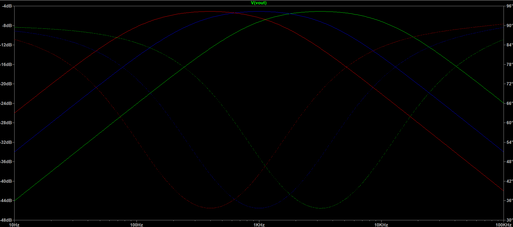
  *Result:* Demonstrated tunable center frequencies and variable Q-factors by sweeping the primary input resistor through 5 kΩ, 15.9 kΩ, and 40 kΩ.

---

### Notch Filter (Band-Stop) Configuration
To demonstrate highly targeted frequency rejection, the test bench was modified into a "Twin-T" bridge topology. This filter was specifically calculated and balanced to act as a band-stop, successfully eliminating a targeted frequency while allowing all surrounding high and low frequencies to pass.

* **Topological Schematic:** 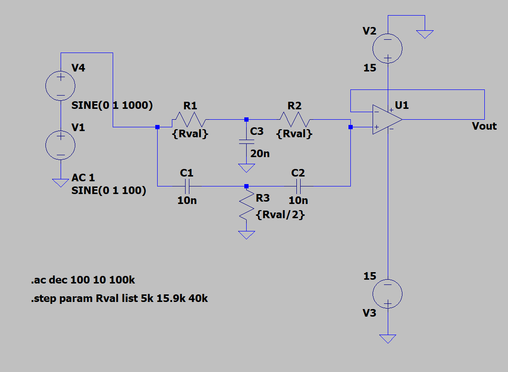
* **Transient Analysis:** 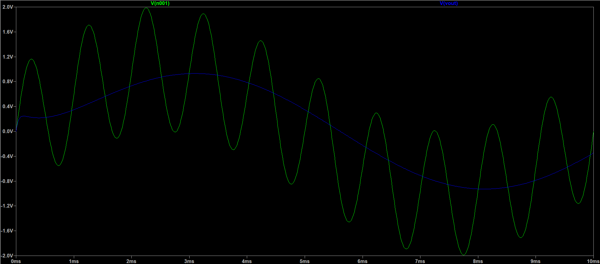
  *Result:* Completely eliminated a 1 kHz interference signal from a baseline 100 Hz wave in the time domain.
* **Parametric Sweep:** 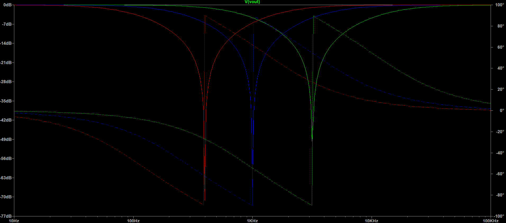
  *Result:* Demonstrated precise tunability of the rejection band by sweeping the parallel bridge resistor values through 5 kΩ, 15.9 kΩ, and 40 kΩ, while maintaining the fractional balance required for Twin-T stability.
* **Topological Schematic:** *(images/notch-schematic.png)*
* **Transient Analysis:** *(images/notch-transient.png)*
  *Result:* Completely eliminated a 1 kHz interference signal from a baseline 100 Hz wave in the time domain.
* **Parametric Sweep:** *(images/notch-sweep.png)*
  *Result:* Demonstrated precise tunability of the rejection band by sweeping the parallel bridge resistor values through 5 kΩ, 15.9 kΩ, and 40 kΩ, while maintaining the fractional balance required for Twin-T stability.
